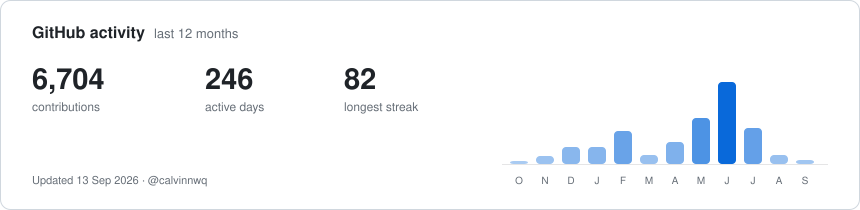

## Hi, I'm Calvin 👋

AI-native builder & problem solver.
Senior SWE @ Atlassian, based in Sydney 🇦🇺, originally from Singapore 🇸🇬.

I build tools for the messy middle of agentic engineering: planning real work, coordinating specialist agents, validating changes, preserving useful evidence, and keeping humans in the loop without slowing everything down.

## What I'm building

### Sites

- [ShakedownKit](https://shakedownkit.com/) - Ultralight backpacking gear management.
- [The Unbusy Co](https://theunbusy.co/) - Workflow systems and automation that make work less busy.
- [ngxcalvin.com](https://ngxcalvin.com/) - My personal site and writing about AI, engineering, decision-making, health, and adventure.

### Open source

- [Agent Swarm](https://github.com/calvinnwq/agent-swarm) - Focused swarms of AI agents with deterministic synthesis: many agents on the problem, one answer back.
- [Momentum](https://github.com/calvinnwq/momentum) - a TypeScript CLI for durable autonomous repo-work orchestration, local verification, and goal-to-implementation loops.
- [Skill Suitcase](https://github.com/calvinnwq/skill-suitcase) - read-only planning and packaging for portable agent skills across agent homes and toolchains.
- [Artshelf](https://github.com/calvinnwq/artshelf) - accountable retention for the temporary files, logs, exports, and evidence that agents leave behind.
- [Reasoning Benchmark](https://github.com/calvinnwq/reasoning-benchmark) - small prompts that test whether models actually understand the question, not just the words in it.

## Current Focus
I'm spending most of my personal build time on:

- making AI-agent workflows more inspectable, restartable, and boringly reliable
- turning coding agents into systems that can plan, execute, verify, review, and clean up real changes
- building reusable skills, workflows, and tools that work across Codex, Claude, OpenClaw, and local CLI environments
- writing about AI, engineering, decision-making, health, and adventure at ngxcalvin.com
- building ShakedownKit for ultralight hikers who want better gear lists, reusable kits, and shakedown-ready pack planning

## What I Care About
I like tools that are small, sharp, and honest about their contract.

Good agent tooling should leave a trail: what it planned, what it changed, what passed, what failed, what needs a human, and how to roll back. The interesting work is not just making agents faster. It is making them dependable enough to trust with real workflows.

Outside the terminal, I’m into mountaineering, hiking, surfing, strength training, and the kind of gear nerdery that makes pack weight spreadsheets feel completely reasonable.

## GitHub activity

<picture>
  <source media="(prefers-color-scheme: dark)" srcset="./profile-summary-card-output/github_dark/0-profile-details.svg">
  
</picture>

<!--
Here are some ideas to get you started:

- 🔭 I’m currently working on ...
- 🌱 I’m currently learning ...
- 👯 I’m looking to collaborate on ...
- 🤔 I’m looking for help with ...
- 💬 Ask me about ...
- 📫 How to reach me: ...
- 😄 Pronouns: ...
- ⚡ Fun fact: ...
-->
