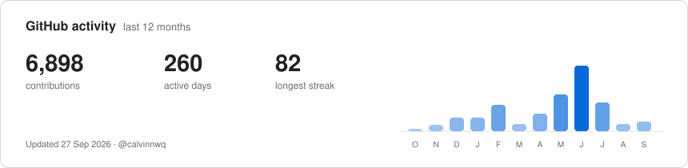

## Hi, I'm Calvin 👋

Engineer at Nous Research, based in Sydney. Previously 10+ years at Atlassian.

I work on the messy middle of agentic engineering, making agent workflows inspectable, testable and dependable enough to trust.

## Sites

- [The Unbusy Co](https://theunbusy.co/) - Founder. We find the admin drag in growing teams and build workflows that run themselves.
- [ShakedownKit](https://shakedownkit.com/) - Ultralight backpacking gear management.
- [ngxcalvin.com](https://ngxcalvin.com/) - Writing on AI, engineering, and adventure.

## Open source

- [Agent Swarm](https://github.com/calvinnwq/agent-swarm) - Many agents on the problem, one answer back.
- [Agent Profile Benchmark](https://github.com/calvinnwq/agent-profile-benchmark) - Reproducible evals for AI agent profiles on real tasks.
- [Reasoning Benchmark](https://github.com/calvinnwq/reasoning-benchmark) - Does the model understand the question, or just the words?
- [Skill Suitcase](https://github.com/calvinnwq/skill-suitcase) - Portable agent skills across toolchains.
- [Hermes Discord Clarify](https://github.com/calvinnwq/hermes-discord-clarify) - Readable multiple-choice prompts for Hermes in Discord.
- [Artshelf](https://github.com/calvinnwq/artshelf) - Accountable retention for the files agents leave behind.
- [Momentum](https://github.com/calvinnwq/momentum) - CLI for autonomous repo work with local verification.

Outside the terminal: mountaineering, hiking, surfing, strength training, and pack-weight spreadsheets.

<picture>
  <source media="(prefers-color-scheme: dark)" srcset="./profile-summary-card-output/github_dark/0-profile-details.svg">
  
</picture>
